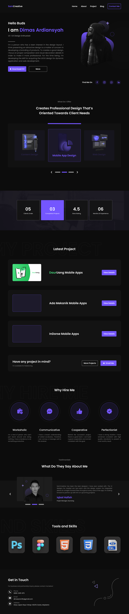

# 🌐 Frontend Portfolio Website

A responsive and interactive frontend portfolio website built with **HTML**, **CSS**, and **JavaScript**. This site showcases my projects, skills, and contact information in a sleek, modern layout—designed to impress clients and employers alike.

---

## 🛠️ Tech Stack

- 💻 HTML5 – Semantic, accessible structure
- 🎨 CSS3 – Custom styling with animations and transitions
- ⚙️ JavaScript – Smooth scroll, interactive components, and dynamic features

---

## 📸 Features

- 🎯 Fully responsive design (mobile-first)
- 🖼️ Hero section with intro and call-to-action
- 🧩 Projects section with hover effects
- 📄 About section with bio and skills
- 📬 Contact form with basic validation
- 🌙 Light/Dark mode toggle (optional)

---

## 📸 Screenshots

  
---

## 📬 Contact

Feel free to reach out if you'd like to collaborate or have any questions!

- 📧 rehmanmirza458@gmail.com
- 🌐 [yourwebsite.com](abdulrehmandev.vercel.app)  

---

> Built by Abdul Rehman
